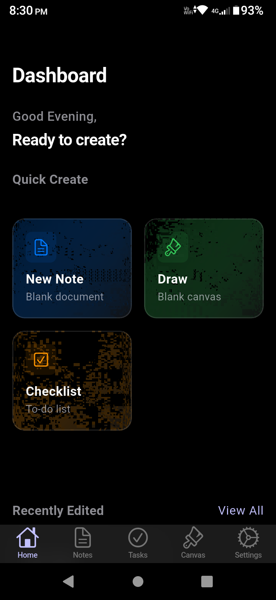
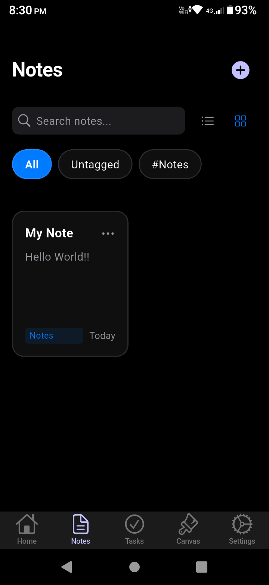
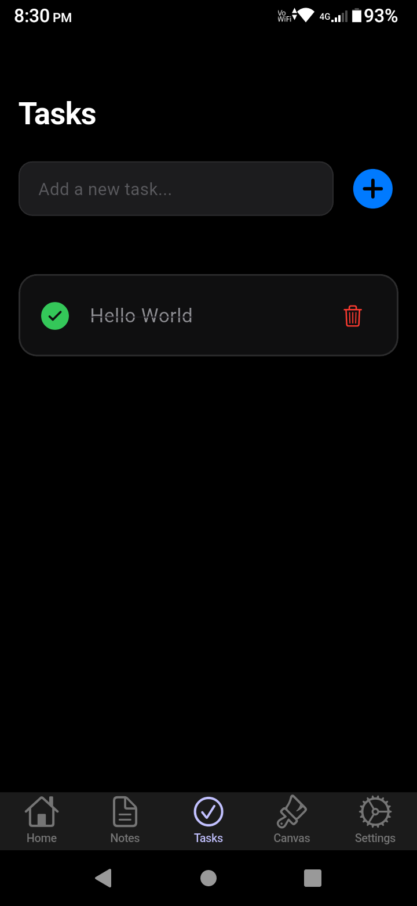
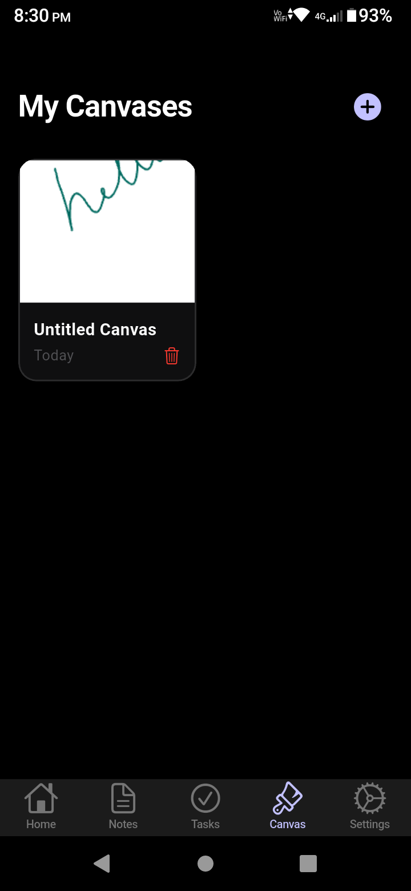
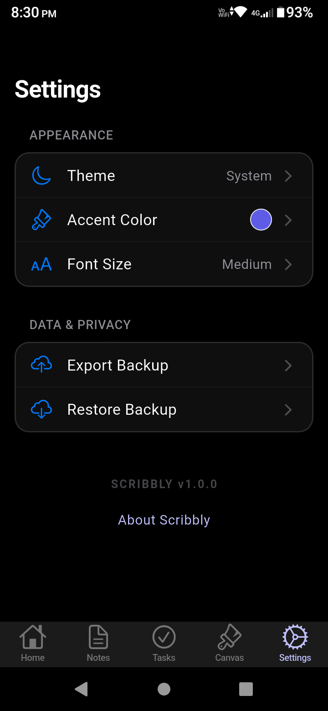
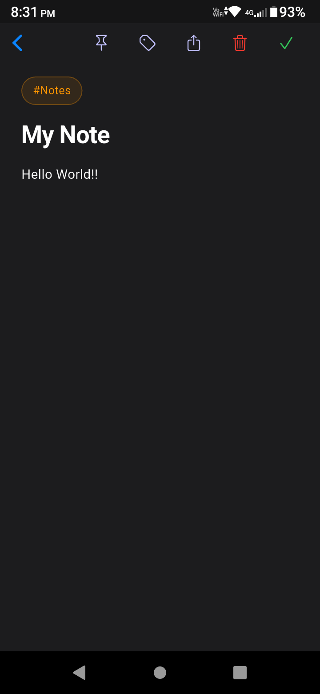

<div align="center">
  
  
  # Scribbly
  **An elegant, immersive note-taking and canvas drawing app built with Flutter.**
</div>

---

Scribbly is designed with a premium, iOS-inspired aesthetic (utilizing Cupertino widgets) to provide a frictionless and beautiful environment for your ideas. Whether you are typing up meeting notes or sketching out a new UI concept, Scribbly gives you the perfect blank slate.

## ✨ Features

- 📝 **Immersive Note Editor**: Distraction-free, full-screen note-taking with automatic dark mode support, intelligent tagging, and pinning.
- 🎨 **Infinite Canvas Drawing**: Express your creativity on an infinite canvas with a sleek, horizontally-scrolling frosted glass toolbar.
- 🛠️ **Rich Drawing Tools**: Choose between Pen, Brush, and Eraser, adjust thickness, and seamlessly undo strokes.
- 📤 **PDF Export**: Export your beautifully formatted markdown notes directly to PDF.
- 🌗 **Beautiful Dark Mode**: Automatically adapts to your system theme with carefully curated dark mode colors and glassmorphism effects.

---

## 📸 Screenshots

<div align="center">
  
  
  
</div>
<br>
<div align="center">
  
  
  
</div>

---

## 🚀 Getting Started

### Prerequisites
- Flutter SDK (v3.12.0 or higher)
- Android Studio or Xcode (for iOS)

### Installation

1. Clone the repository:
   ```bash
   git clone https://github.com/netankur/scribbly.git
   ```
2. Navigate into the directory:
   ```bash
   cd scribbly
   ```
3. Get the dependencies:
   ```bash
   flutter pub get
   ```
4. Run the app:
   ```bash
   flutter run
   ```

## 🛠️ Built With
- **[Flutter](https://flutter.dev/)** - UI Toolkit
- **[Provider](https://pub.dev/packages/provider)** - State Management
- **[Google Fonts](https://pub.dev/packages/google_fonts)** - Plus Jakarta Sans Typography
- **[PDF](https://pub.dev/packages/pdf)** - PDF Exporting

---
<div align="center">
  <i>Crafted with ❤️ in Flutter.</i>
</div>
